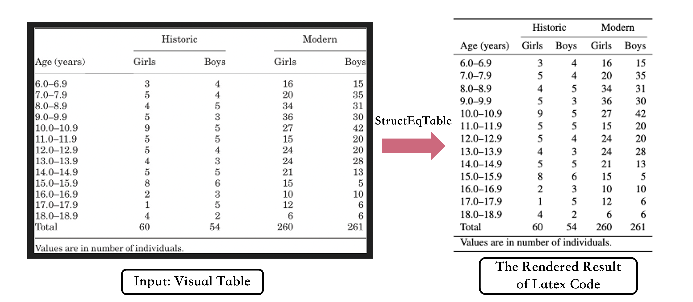
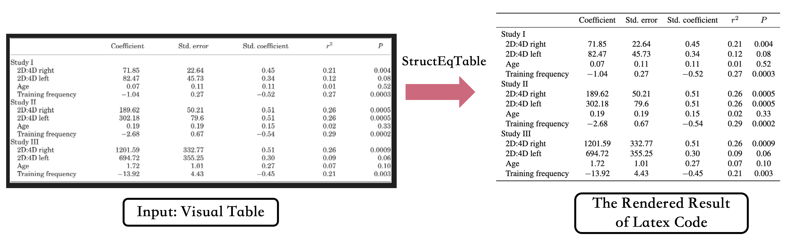

<div align="center">
<h1>StructEqTable-Deploy: A High-efficiency Open-source Toolkit for Table-to-Latex Transformation</h1>


[[ Related Paper ]](https://arxiv.org/abs/2406.11633) [[ Website ]](https://unimodal4reasoning.github.io/DocGenome_page/) [[ Dataset (Google Drive)]](https://drive.google.com/drive/folders/1OIhnuQdIjuSSDc_QL2nP4NwugVDgtItD) [[ Dataset (Hugging Face) ]](https://huggingface.co/datasets/U4R/DocGenome/tree/main)

[[Models 🤗(Hugging Face)]](https://huggingface.co/U4R/StructTable-base/tree/main)


</div>

Welcome to the official repository of StructEqTable-Deploy, a solution that converts images of Table into LaTeX, powered by scalable data from [DocGenome benchmark](https://unimodal4reasoning.github.io/DocGenome_page/).


## Overview
Table is an effective way to represent structured data in scientific publications, financial statements, invoices, web pages, and many other scenarios. Extracting tabular data from a visual table image and performing the downstream reasoning tasks according to the extracted data is challenging, mainly due to that tables often present complicated column and row headers with spanning cell operation. To address these challenges, we present TableX, a large-scale multi-modal table benchmark extracted from [DocGenome benchmark](https://unimodal4reasoning.github.io/DocGenome_page/) for table pre-training, comprising more than 2 million high-quality Image-LaTeX pair data covering 156 disciplinary classes. Besides, benefiting from such large-scale data, we train an end-to-end model, StructEqTable, which provides the capability to precisely obtain the corresponding LaTeX description from a visual table image and perform multiple table-related reasoning tasks, including structural extraction and question answering, broadening its application scope and potential.

## Changelog
Tips: Current version of StructEqTable is able to process table images from scientific documents such as arXiv, Scihub papers. Times New Roman And Songti(宋体) are main fonts used in table image, other fonts may decrease the accuracy of the model's output.
- **[2024/8/22] 🔥 We have released our [latest model](https://huggingface.co/U4R/StructTable-base/tree/v0.2), fine-tuned on the DocGenome dataset. This version features improved inference speed and robustness, achieved through data augmentation and reduced image token num.** 
- [2024/8/08] We have released the TensorRT accelerated version, which only takes about 1 second for most images on GPU A100. Please follow the tutorial to install the environment and compile the model weights.
- [2024/7/30] We have released the first version of StructEqTable. 

## TODO

- [x] Release inference code and checkpoints of StructEqTable.
- [x] Support Chinese version of StructEqTable.
- [x] Accelerated version of StructEqTable using TensorRT-LLM.
- [ ] Expand more domains of table image to improve the model's general capabilities.
- [ ] Release our table pre-training and fine-tuning code

## Efficient Inference
Our model now supports TensorRT-LLM deployment, achieving a 10x or more speedup in during inference.  
Please refer to [GETTING_STARTED.md](docs/GETTING_STARTED.md) to learn how to depoly.

## Installation
``` bash 
conda create -n structeqtable python>=3.10
conda activate structeqtable

# Install from Source code  (Suggested)
git clone https://github.com/UniModal4Reasoning/StructEqTable-Deploy.git
cd StructEqTable-Deploy
python setup develop

# or Install from Github repo
pip install "git+https://github.com/UniModal4Reasoning/StructEqTable-Deploy.git"

# or Install from PyPI
pip install struct-eqtable==0.1.0
```

## Model Zoo

| Model | Image Token Num | Model Size | Training Data | Data Augmentation | TensorRT | HuggingFace |
|---------------------|---------------------|------------|------------------|-------------------|----------|-------------------|
| StructEqTable-base | 4096 | ~300M | DocGenome | ☐  | ☑️ | [v0.1](https://huggingface.co/U4R/StructTable-base/tree/v0.1) |
| StructEqTable-base | 2048 | ~300M | DocGenome | ☑️ | ☑️ | [v0.2](https://huggingface.co/U4R/StructTable-base/tree/v0.2) |


## Quick Demo
- Run the demo/demo.py
```shell script
cd tools/demo

python demo.py \
  --image_path ./demo.png \
  --ckpt_path ${CKPT_PATH} \
  --output_format latex
```

- HTML or Markdown format output

  Our model output Latex format code by default. 
  If you want to get other format like HTML or Markdown, 
  `pypandoc` support convert latex format code into HTML and Markdown format for simple table (table has no merge cell ).

```shell script
sudo apt install pandoc
pip install pypandoc

cd tools/demo

python demo.py \
  --image_path ./demo.png \
  --ckpt_path ${CKPT_PATH} \
  --output_format html markdown
```


- Visualization Results
    - The input data are sampled from SciHub domain.






## Acknowledgements
- [DocGenome](https://github.com/UniModal4Reasoning/DocGenome). An Open Large-scale Scientific Document Benchmark for Training and Testing Multi-modal Large Models.
- [ChartVLM](https://github.com/UniModal4Reasoning/ChartVLM). A Versatile Benchmark and Foundation Model for Complicated Chart Reasoning.
- [Pix2Struct](https://github.com/google-research/pix2struct). Screenshot Parsing as Pretraining for Visual Language Understanding.
- [UniMERNet](https://github.com/opendatalab/UniMERNet). A Universal Network for Real-World Mathematical Expression Recognition.
- [Donut](https://huggingface.co/naver-clova-ix/donut-base). The UniMERNet's Transformer Encoder-Decoder are referenced from Donut.
- [Nougat](https://github.com/facebookresearch/nougat). The tokenizer uses Nougat.  
- [TensorRT-LLM](https://github.com/NVIDIA/TensorRT-LLM). Model inference acceleration uses TensorRT-LLM.


## License
StructEqTable is released under the [Apache License 2.0](LICENSE)

## Citation
If you find our models / code / papers useful in your research, please consider giving ⭐ and citations 📝, thx :)  
```bibtex
@article{xia2024docgenome,
  title={DocGenome: An Open Large-scale Scientific Document Benchmark for Training and Testing Multi-modal Large Language Models},
  author={Xia, Renqiu and Mao, Song and Yan, Xiangchao and Zhou, Hongbin and Zhang, Bo and Peng, Haoyang and Pi, Jiahao and Fu, Daocheng and Wu, Wenjie and Ye, Hancheng and others},
  journal={arXiv preprint arXiv:2406.11633},
  year={2024}
}
```

## Contact Us
If you encounter any issues or have questions, please feel free to contact us via zhouhongbin@pjlab.org.cn.
