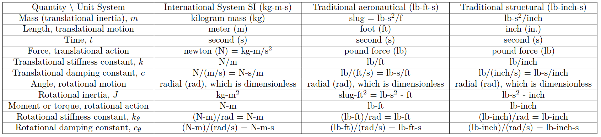

<div align="center">
<h1>StructEqTable-Deploy: A High-efficiency Open-source Toolkit for Table-to-Latex Transformation</h1>


[[ Paper ]](https://arxiv.org/abs/2406.11633) [[ Website ]](https://unimodal4reasoning.github.io/DocGenome_page/) [[ Dataset🤗 ]](https://huggingface.co/datasets/U4R/DocGenome/tree/main) [[ Models🤗 ]](https://huggingface.co/U4R/StructTable-InternVL2-1B/tree/main) [[ Demo💬 ]](https://www.modelscope.cn/studios/HongbinZhou/StructEqTable-Demo/)


</div>

Welcome to the official repository of StructEqTable-Deploy, a solution that converts images of Table into LaTeX/HTML/MarkDown, powered by scalable data from [DocGenome benchmark](https://unimodal4reasoning.github.io/DocGenome_page/).


## Overview
Table is an effective way to represent structured data in scientific publications, financial statements, invoices, web pages, and many other scenarios. Extracting tabular data from a visual table image and performing the downstream reasoning tasks according to the extracted data is challenging, mainly due to that tables often present complicated column and row headers with spanning cell operation. To address these challenges, we present TableX, a large-scale multi-modal table benchmark extracted from [DocGenome benchmark](https://unimodal4reasoning.github.io/DocGenome_page/) for table pre-training, comprising more than 2 million high-quality Image-LaTeX pair data covering 156 disciplinary classes. Besides, benefiting from such large-scale data, we train an end-to-end model, StructEqTable, which provides the capability to precisely obtain the corresponding LaTeX description from a visual table image and perform multiple table-related reasoning tasks, including structural extraction and question answering, broadening its application scope and potential.

## Changelog
- [2024/10/19] 🔥 We have released our **latest model [StructTable-InternVL2-1B](https://huggingface.co/U4R/StructTable-InternVL2-1B/tree/main)**! 

  Thanks to IntenrVL2 powerful foundational capabilities, and through fine-tuning on the synthetic tabular data and DocGenome dataset, StructTable can convert table image into various common table formats including LaTeX, HTML, and Markdown. Moreover, inference speed has been significantly improved compared to the v0.2 version.
- [2024/8/22] We have released our StructTable-base-v0.2, fine-tuned on the DocGenome dataset. This version features improved inference speed and robustness, achieved through data augmentation and reduced image token num.
- [2024/8/08] We have released the TensorRT accelerated version, which only takes about 1 second for most images on GPU A100. Please follow the tutorial to install the environment and compile the model weights.
- [2024/7/30] We have released the first version of StructEqTable. 

## TODO

- [x] Release inference code and checkpoints of StructEqTable.
- [x] Support Chinese version of StructEqTable.
- [x] Accelerated version of StructEqTable using TensorRT-LLM.
- [x] Expand more domains of table image to improve the model's general capabilities.
- [x] Efficient inference of StructTable-InternVL2-1B by [LMDeploy](https://github.com/InternLM/lmdeploy) Tookit.
- [ ] Release our table pre-training and fine-tuning code


## Installation
``` bash 
conda create -n structeqtable python>=3.10
conda activate structeqtable

# Install from Source code  (Suggested)
git clone https://github.com/UniModal4Reasoning/StructEqTable-Deploy.git
cd StructEqTable-Deploy
pip install -r requirements.txt
python setup develop

# or Install from Github repo
pip install "git+https://github.com/UniModal4Reasoning/StructEqTable-Deploy.git"

# or Install from PyPI
pip install struct-eqtable --upgrade
```

## Model Zoo

| Base Model | Model Size | Training Data | Data Augmentation | LMDeploy | TensorRT | HuggingFace |
|---------------------|------------|------------------|-------------------|----------|----------|-------------------|
| InternVL2-1B | ~1B | DocGenome and Synthetic Data | ✔ | ✔ | | [StructTable v0.3](https://huggingface.co/U4R/StructTable-InternVL2-1B/tree/main) |
| Pix2Struct-base | ~300M | DocGenome | ✔ | | ✔ | [StructTable v0.2](https://huggingface.co/U4R/StructTable-base/tree/v0.2) |
| Pix2Struct-base | ~300M | DocGenome | | | ✔ | [StructTable v0.1](https://huggingface.co/U4R/StructTable-base/tree/v0.1) |


## Quick Demo
- Run the demo/demo.py
```shell script
cd tools/demo

python demo.py \
  --image_path ./demo.png \
  --ckpt_path U4R/StructTable-InternVL2-1B \
  --output_format latex
```

- HTML or Markdown format output (Only Supported by StructTable-InternVL2-1B)

```shell script
python demo.py \
  --image_path ./demo.png \
  --ckpt_path U4R/StructTable-InternVL2-1B \
  --output_format html markdown
```

## Efficient Inference
- Install LMDeploy Tookit
```shell script
pip install lmdeploy
```

- Run the demo/demo.py
```shell script
cd tools/demo

python demo.py \
  --image_path ./demo.png \
  --ckpt_path U4R/StructTable-InternVL2-1B \
  --output_format latex \
  --lmdeploy
```


- Visualization Result

  You can copy the output LaTeX code into [demo.tex](../tools/demo/demo.tex), then use [Overleaf](https://www.overleaf.com/project) for table visualization.



## Acknowledgements
- [DocGenome](https://github.com/UniModal4Reasoning/DocGenome). An Open Large-scale Scientific Document Benchmark for Training and Testing Multi-modal Large Models.
- [ChartVLM](https://github.com/UniModal4Reasoning/ChartVLM). A Versatile Benchmark and Foundation Model for Complicated Chart Reasoning.
- [Pix2Struct](https://github.com/google-research/pix2struct). Screenshot Parsing as Pretraining for Visual Language Understanding.
- [InternVL Family](https://github.com/OpenGVLab/InternVL). A Series of Powerful Foundational Vision-Language Models.
- [LMDeploy](https://github.com/InternLM/lmdeploy). A toolkit for compressing, deploying, and serving LLM and MLLM.
- [UniMERNet](https://github.com/opendatalab/UniMERNet). A Universal Network for Real-World Mathematical Expression Recognition.
- [Donut](https://huggingface.co/naver-clova-ix/donut-base). The UniMERNet's Transformer Encoder-Decoder are referenced from Donut.
- [Nougat](https://github.com/facebookresearch/nougat). Data Augmentation follows Nougat.  
- [TensorRT-LLM](https://github.com/NVIDIA/TensorRT-LLM). Model inference acceleration uses TensorRT-LLM.


## License
StructEqTable is released under the [Apache License 2.0](LICENSE)

## Citation
If you find our models / code / papers useful in your research, please consider giving ⭐ and citations 📝, thx :)  
```bibtex
@article{xia2024docgenome,
  title={DocGenome: An Open Large-scale Scientific Document Benchmark for Training and Testing Multi-modal Large Language Models},
  author={Xia, Renqiu and Mao, Song and Yan, Xiangchao and Zhou, Hongbin and Zhang, Bo and Peng, Haoyang and Pi, Jiahao and Fu, Daocheng and Wu, Wenjie and Ye, Hancheng and others},
  journal={arXiv preprint arXiv:2406.11633},
  year={2024}
}
```

## Contact Us
If you encounter any issues or have questions, please feel free to contact us via zhouhongbin@pjlab.org.cn.
