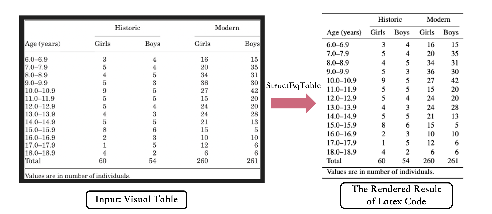

<div align="center">
<h1>StructEqTable-Deploy: A High-efficiency Open-source Toolkit for Table-to-Latex Transformation</h1>


[[ Related Paper ]](https://arxiv.org/abs/2406.11633) [[ Website ]](https://unimodal4reasoning.github.io/DocGenome_page/) [[ Dataset (Google Drive)]](https://drive.google.com/drive/folders/1OIhnuQdIjuSSDc_QL2nP4NwugVDgtItD) [[ Dataset (Hugging Face) ]](https://huggingface.co/datasets/U4R/DocGenome/tree/main)

[[Models 🤗(Hugging Face)]](https://huggingface.co/U4R/StructTable-base/tree/main)


</div>

Welcome to the official repository of StructEqTable-Deploy, a solution that converts images of Table into LaTeX, powered by scalable data from [DocGenome benchmark](https://unimodal4reasoning.github.io/DocGenome_page/).


## Abstract
Table is an effective way to represent structured data in scientific publications, financial statements, invoices, web pages, and many other scenarios. Extracting tabular data from a visual table image and performing the downstream reasoning tasks according to the extracted data is challenging, mainly due to that tables often present complicated column and row headers with spanning cell operation. To address these challenges, we present TableX, a large-scale multi-modal table benchmark extracted from [DocGenome benchmark](https://unimodal4reasoning.github.io/DocGenome_page/) for table pre-training, comprising more than 2 million high-quality Image-LaTeX pair data covering 156 disciplinary classes. Besides, benefiting from such large-scale data, we train an end-to-end model, StructEqTable, which provides the capability to precisely obtain the corresponding LaTeX description from a visual table image and perform multiple table-related reasoning tasks, including structural extraction and question answering, broadening its application scope and potential.


## TODO

- [x] Release inference code and checkpoints of StructEqTable.
- [x] Support Chinese version of StructEqTable.
- [ ] Improve the inference speed of StructEqTable.


### Installation

``` bash 
conda create -n structeqtable python=3.9

conda activate structeqtable

pip install "git+https://github.com/UniModal4Reasoning/StructEqTable-Deploy.git"

```

## Quick Demo
- run the demo/demo.py
```shell script
cd demo

python demo.py \ --image_path ./demo.png \
  --ckpt_path ${CKPT_PATH}
```

- Visualization Results
    - The input data are sampled from SciHub domain.




## Acknowledgements
- [DocGenome](https://github.com/UniModal4Reasoning/DocGenome). An Open Large-scale Scientific Document Benchmark for Training and Testing Multi-modal Large Models.
- [ChartVLM](https://github.com/UniModal4Reasoning/ChartVLM). A Versatile Benchmark and Foundation Model for Complicated Chart Reasoning.
- [Pix2Struct](https://github.com/google-research/pix2struct). Screenshot Parsing as Pretraining for Visual Language Understanding.
- [UniMERNet](https://github.com/opendatalab/UniMERNet). A Universal Network for Real-World Mathematical Expression Recognition.
- [Donut](https://huggingface.co/naver-clova-ix/donut-base). The UniMERNet's Transformer Encoder-Decoder are referenced from Donut.
- [Nougat](https://github.com/facebookresearch/nougat). The tokenizer uses Nougat.


## License
[Apache License 2.0](LICENSE)

## Citation
If you find our models / code / papers useful in your research, please consider giving ⭐ and citations 📝, thx :)  
```bibtex
@article{xia2024docgenome,
  title={DocGenome: An Open Large-scale Scientific Document Benchmark for Training and Testing Multi-modal Large Language Models},
  author={Xia, Renqiu and Mao, Song and Yan, Xiangchao and Zhou, Hongbin and Zhang, Bo and Peng, Haoyang and Pi, Jiahao and Fu, Daocheng and Wu, Wenjie and Ye, Hancheng and others},
  journal={arXiv preprint arXiv:2406.11633},
  year={2024}
}
```

## Contact Us
If you encounter any issues or have questions, please feel free to contact us via zhouhongbin@pjlab.org.cn.
